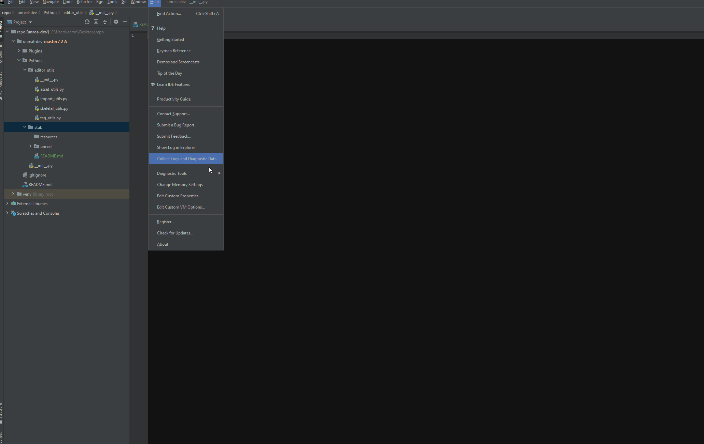

Unreal Stub File
================================

This package contains the Unreal Engine 5 python stub file with directions on how to set it up for auto-completion in an [PyCharm](https://www.jetbrains.com/pycharm).

#### DISCLAIMER 
The `unreal` stub file is dynamic and will get regenerated as developers expose things in Blueprints for their Unreal Projects. The stub file in this package was generated from    the vanilla Unreal Engine 5 Early Access build and is meant for convenience.

#### STUB SIZE 
Due to the size of the `unreal` stub file (about 15 MB) I've converted it into a 
[Python Package](https://docs.python.org/3/tutorial/modules.html#packages) 
so your IDE doesn't crash/hang when you add it to your project 
(just don't click/right-click or try to open the `unreal` directory or `__init__.py` file until you follow the setup steps below, or your IDE might crash).

# Setup Steps
To allow your IDE to open the file you'll need to adjust your content and intellisense file size limits. 
The following steps show how to do this in [PyCharm](https://www.jetbrains.com/pycharm),
but it's the same principle for all IDE's.
1. In PyCharm, go to `Help > Edit Custom Properties...` to open the `idea.properties` file. 
2. Add the following lines, save the file and then restart PyCharm.
   ```
   idea.max.content.load.filesize=250000 
   idea.max.intellisense.filesize=250000
   ```
   - ###### *Feel free to change the `filesize` property value to your liking.*
2. Mark the `stub` directory as a `Sources Root` by right-clicking the `stub` directory and going to `Mark Directory as > Sources Root`
   (you can also do this in your project settings via settings).
   
3. Open a python file, `import unreal` and then do `unreal.` (with the dot) to test that the autocompletion is working (see below).
--- 


